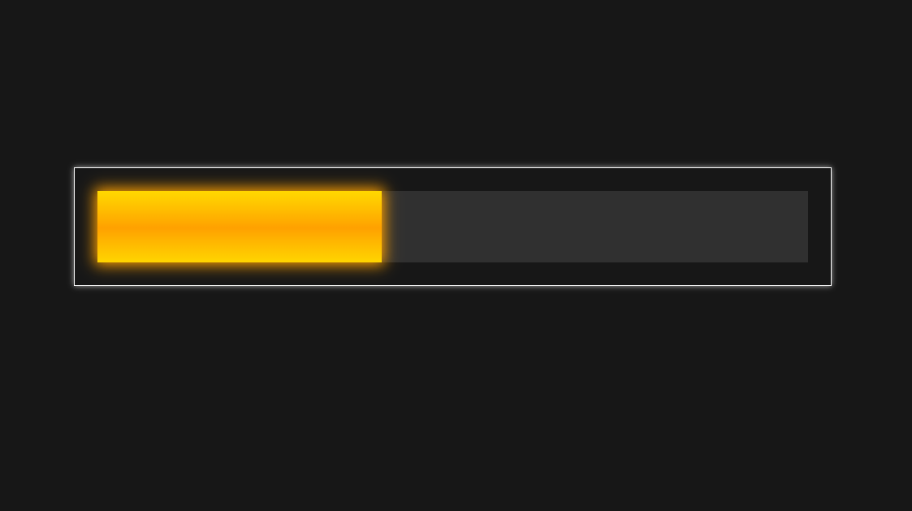
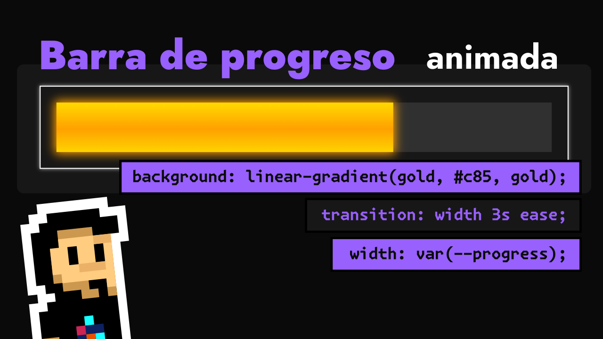

# Progress Bar

- 📘 Gradientes lineales: https://lenguajecss.com/css/gradientes/linear-gradient/
- 📘 Sombras: https://lenguajecss.com/css/sombras/box-shadow/
- 📘 La etiqueta progress: https://lenguajehtml.com/html/formularios/etiqueta-html-progress/
- 📘 Animaciones CSS: https://lenguajecss.com/css/animaciones/animaciones/
- 📘 La función color-mix: https://lenguajecss.com/css/colores/color-mix/

**Previsualización**:

Video de Youtube:

- Twitch: https://twitch.tv/ManzDev
- Twitter: https://twitter.com/Manz
- Redes sociales: https://links.manz.dev/
- Página oficial: https://manz.dev/
